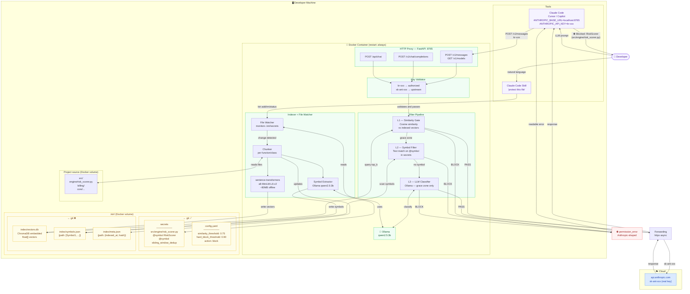

# Integration Diagram — AI Gateway OnPrem

---

## Legend

| Color | Area |
|---|---|
| 🟣 Purple | Developer and tools |
| 🟢 Green | Docker container (on-prem) |
| 🟡 Yellow | Disk store (`.kiri/`) |
| 🔵 Blue | Cloud (api.anthropic.com) |
| 🔴 Red | Block response |

---

## Main flows

| Flow | Path |
|---|---|
| **LLM Prompt** | Developer → Claude Code → Proxy → Key Validator → Filter Pipeline → PASS/BLOCK |
| **PASS** | Filter → Forwarding → api.anthropic.com → response → Developer |
| **BLOCK** | Filter → Anthropic-shaped permission_error → Claude Code → Developer |
| **File protection** | Developer (natural language) → Skill → Watcher → Indexer → Store |
| **Automatic reindex** | Watcher detects secrets change → Chunker → Embedder + Symbol Extractor → Store |
| **New dev** | git clone → secrets available → L2 active immediately → L1 reindex in background |
