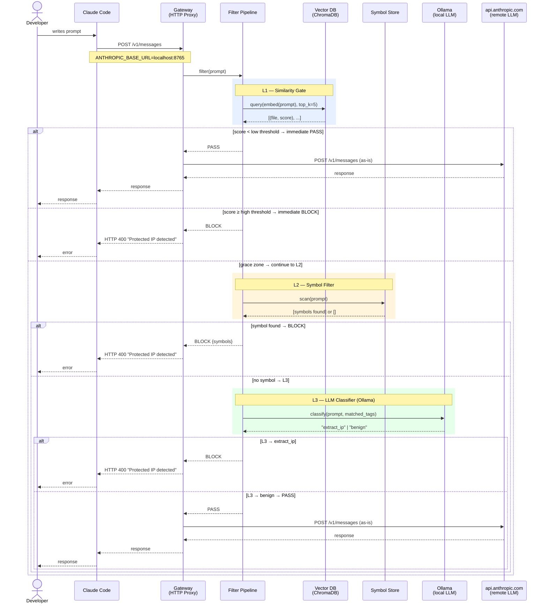
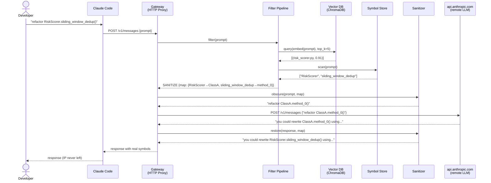

# Sequence Diagram — All Actors

---

## Variant — SANITIZE mode

When `action: sanitize` is configured and symbols are found, instead of blocking the gateway obscures and restores them.

---

## Actors — responsibilities

| Actor | Type | Responsibility |
|---|---|---|
| Developer | human | writes prompt, receives response |
| Claude Code | external tool | HTTP client towards the gateway |
| Gateway (HTTP Proxy) | on-prem | intercepts, orchestrates, forwards |
| Filter Pipeline | on-prem | applies the 3 levels, returns decision |
| Vector DB (ChromaDB) | on-prem | similarity search on codebase embeddings |
| Symbol Store | on-prem | lookup of proprietary symbols in the prompt |
| Ollama (local LLM) | on-prem | L3 classifier — never sees source code |
| api.anthropic.com | cloud | remote LLM — receives only approved/obscured prompts |
| Sanitizer | on-prem | obscures symbols on output, restores in response |
