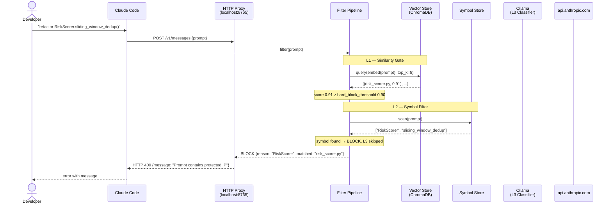
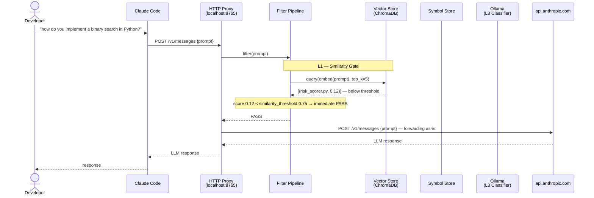
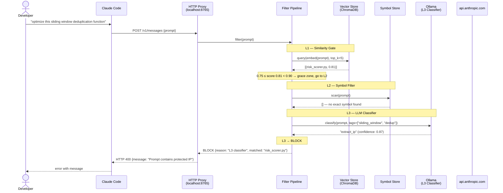
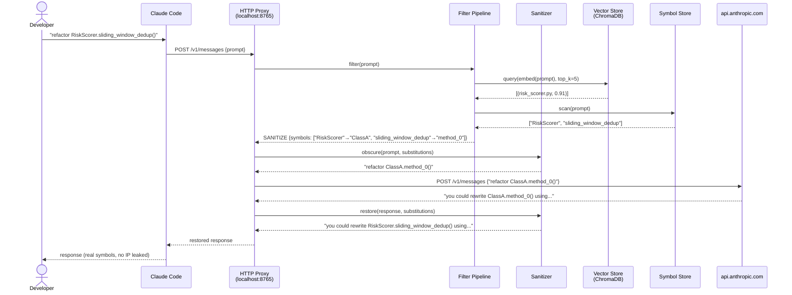

# Sequence — LLM Call through the Gateway

---

## Case 1 — BLOCK (proprietary symbol detected)



---

## Case 2 — PASS (generic prompt)



---

## Case 3 — Grace Zone → L3 Classifier decides



---

## Case 4 — SANITIZE (symbol found, sanitize mode)



---

## Filter Pipeline decision summary

```
incoming prompt
      │
      ▼
  L1 similarity
      │
      ├── score < 0.75  ──────────────────────────────► PASS
      │
      ├── score ≥ 0.90  ──────────────────────────────► BLOCK (skip L2/L3)
      │
      └── 0.75 ≤ score < 0.90  (grace zone)
                │
                ▼
            L2 symbols
                │
                ├── symbol found  ─────────────────► BLOCK
                │
                └── no symbol
                          │
                          ▼
                      L3 Ollama
                          │
                          ├── "extract_ip"  ──────────► BLOCK
                          └── "benign"      ──────────► PASS
```
